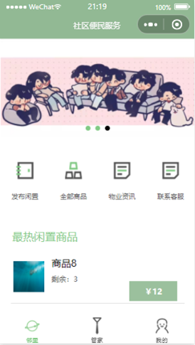
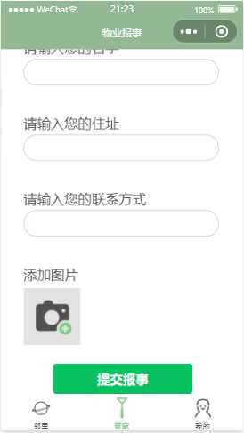
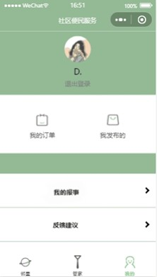

# Community Convenience Service System

## Overview
The **Community Convenience Service System** is a WeChat Mini Program that integrates a **community second-hand trading platform** with a **property management system**.  
It enables residents to easily trade idle goods, submit repair requests, and access community information—all within a lightweight, user-friendly interface.

This project is designed with **simplicity, usability, and practicality** in mind, especially for elderly users who may find traditional mobile apps difficult to use.

## Core Features

### User End
- **Neighborhood Page**
  - Publish second-hand goods (name, price, quantity, image upload)
  - View all listed items with real-time stock and price updates
  - Access property news and community bulletins
  - View property manager contact information  

- **Property Manager Page**
  - Submit maintenance or complaint requests
  - Fill in type, contact info, address, and upload images  

- **Personal Center**
  - View “My Orders” with order statuses (Pending, Completed, Cancelled)
  - Manage “My Posts” (Published, Pending, Completed)
  - View “My Reports” (submitted maintenance requests)

### Admin End
- **Content Management**
  - Add / Edit / Delete property information and manager records  
- **Product Management**
  - Manage item name, price, stock, image, homepage recommendation, and sale status  
- **Repair Management**
  - Collect and respond to user-submitted maintenance requests  

## System Architecture

| Layer | Description |
|-------|-------------|
| **Frontend** | WeChat Mini Program (WXML + WXSS + JS + JSON) |
| **Backend** | WeChat Cloud Development (Serverless architecture) |
| **Database** | Tencent Cloud Database (JSON-based NoSQL) |
| **CMS** | WeChat Cloud CMS for content management |

## Database Design

| Collection | Purpose | Key Fields |
|-------------|----------|------------|
| `goods` | Second-hand goods | `_id`, `name`, `price`, `img`, `num`, `tuijian`, `content` |
| `order` | Orders | `_id`, `name`, `phone`, `address`, `status`, `totalPrice`, `goods`, `beizhu` |
| `news` | Property news | `_id`, `title`, `author`, `hits`, `content` |
| `huishou` | Property managers | `_id`, `name`, `phone`, `weixin` |
| `baoshis` | Repair reports | `_id`, `name`, `type`, `img`, `phone`, `address`, `content` |
| `lunbotu` | Carousel images | `_id`, `url` |

## Cloud Functions

| Function | Purpose |
|-----------|----------|
| `getGoodList` | Retrieve all products or recommended items |
| `addXiaoLiang` | Increase or decrease product quantity |
| `getData` | Fetch property news and community data |
| `getOpenid` | Retrieve user OpenID for identity mapping |
| `baoshiGetList` | Retrieve maintenance reports |
| `changeGood` | Update product status |

These functions ensure **real-time updates**, **secure data operations**, and **automated backend workflows** without manual server deployment.

## UI & UX Design
- Minimalistic design with **soft green tones** for comfort and clarity.  
- Simplified navigation optimized for **low digital literacy users**.  
- Clear tab-based layout for:
  - Neighbourhood services  
  - Property reports  
  - Personal management  

## Technical Stack

| Category | Tools / Frameworks |
|-----------|--------------------|
| **Frontend** | WXML, WXSS, JavaScript, JSON |
| **Backend** | WeChat Cloud Functions (Serverless) |
| **Database** | Tencent Cloud Database |
| **CMS** | WeChat Cloud CMS |
| **IDE** | WeChat Developer Tools |

## System Testing

| Test Type | Scope | Result |
|------------|--------|--------|
| **UI Testing** | Layout consistency across devices (iPhone 5, Nexus 6) | Passed |
| **Functionality Testing** | Navigation, product uploads, order flow, login authentication | Passed |
| **Compatibility Testing** | WeChat DevTool performance across devices | Passed |

## Key Highlights
- Fully **Serverless architecture**, no backend server required  
- **Cloud database** integrated with CMS for seamless content management  
- **Responsive and intuitive UI**, accessible to all user groups  
- Supports **real-time synchronization** and **modular code structure**

## Developer Notes
This project demonstrates strong capabilities in **full-stack WeChat Mini Program development**, **cloud architecture design**, and **data-driven UI logic**.  
It serves as a practical example of applying **cloud computing and lightweight development** to improve community digital services.

## Preview  

