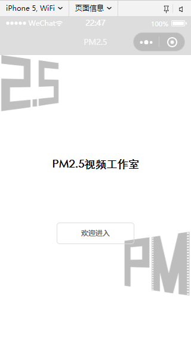
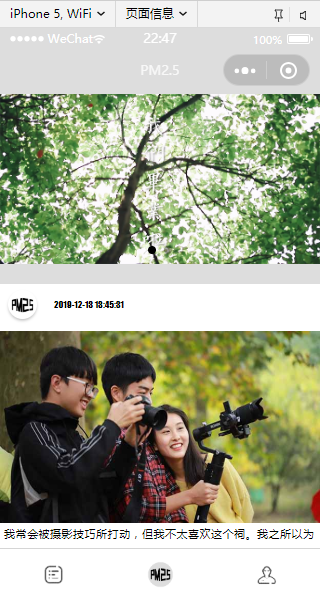
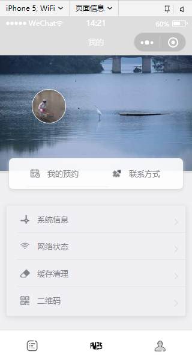
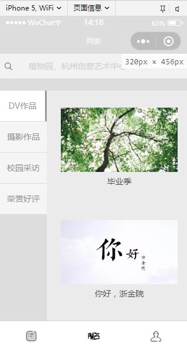
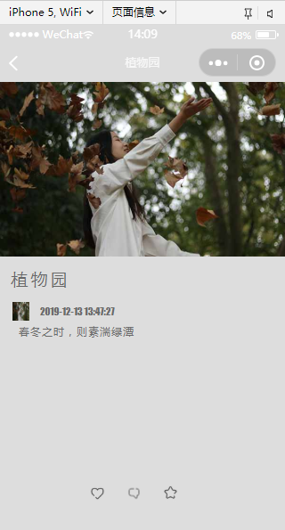
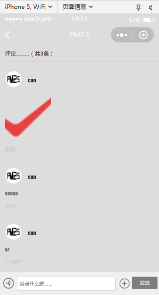

# PM2.5 Studio WeChat Mini Program  

## Overview  
The **PM2.5 Studio Mini Program** is a WeChat-based application developed for **PM2.5 Studio**, a creative media organisation focused on **digital video, photography, and campus interviews**.  
This project integrates media presentation, reservation management, and system utilities into one seamless mobile platform inside the WeChat ecosystem.  

Built using the **WeChat Mini Program Framework** with **WXML, WXSS, and JavaScript**, the program demonstrates a modular architecture, API data integration, and responsive UI design.

## Keywords  
**WeChat Mini Program** · **Media Showcase** · **Photography** · **JSON Data Integration** · **Mobile UX** · **Digital Studio Platform**

## Features & Structure  

The program consists of three main navigation tabs, each containing multiple submodules:

### Home  
**Purpose:** Display studio works and provide quick access to reservations.

#### Components  
- **Carousel Banner** – Rotating images showcasing featured projects  
- **Latest Works** – Dynamically fetched list of recent posts (title, image, author, summary, publish date)  
- **Work Details** – Dedicated article pages for each project  
- **Interactive Features** – Like, Comment, and Collect
- **Reservation Section**  
  - *Production Appointment*: Book content creation sessions  
  - *Equipment Booking*: Reserve studio devices  

### Works  
**Purpose:** Categorised presentation of all creative outputs from PM2.5 Studio.

#### Categories Overview  

| Category | Description | Key Highlights |
|-----------|--------------|----------------|
| **DV Works** | Short films, creative video projects, and experimental clips | Script-based storytelling and post-production editing |
| **Photography Works** | Professional photo collections, event documentation, and creative portraits | Composition, lighting, and tone mapping techniques |
| **Campus Interviews** | Student-centered interviews and on-campus reports | Emphasis on narrative flow and editing rhythm |
| **Awards & Recognition** | Certificates, honors, and media achievements | Proof of excellence and brand credibility |

Each category’s data is retrieved dynamically through JSON files and rendered using WeChat Mini Program components.

### User  
**Purpose:** Provide user utilities, system access, and WeChat login integration.

#### Functions  
- **My Reservations** – Displays all current and past bookings  
- **Contact Information** – Studio address, social media, and contact channels  
- **System Information** – Retrieves device specifications using `wx.getSystemInfo`  
- **Network Status** – Displays connectivity type with `wx.getNetworkType`  
- **Cache Management** – Clear local storage and app cache  
- **QR Code Scanning** – Implements `wx.scanCode()`  
- **WeChat Login** – Authorise and sync WeChat user profile  

If the user is not logged in, the avatar area remains hidden until login authorisation.

## Technical Implementation  

| Layer | Technology | Description |
|-------|-------------|-------------|
| **Frontend** | WXML, WXSS, JavaScript | UI components and interaction logic |
| **Framework** | WeChat Mini Program Framework | Page routing and state management |
| **Data Source** | Local JSON files / Mock APIs | Dynamic data rendering for works and articles |
| **Utilities** | `wx.*` APIs | Device info, system status, geolocation, scanning |
| **Development Tools** | WeChat DevTools, Photoshop CS6 | UI layout and image asset design |

## Project Highlights  

- **Modular Architecture** — Logical page hierarchy (Home, Works, User)  
- **Dynamic Content Loading** — Fetches and displays JSON-based data in real time  
- **WeChat API Integration** — Leverages native APIs for device and network interaction  
- **User Interaction Layer** — Likes, comments, and favourites with local persistence  
- **Responsive UI Design** — Adapts fluidly to multiple screen resolutions  

---
## Preview  

---

---

## Project Significance  

The **PM2.5 Studio Mini Program** demonstrates the integration of multimedia content, interactive systems, and WeChat-native APIs into a unified digital environment.  
It empowers creative studios to:  
- Present digital works in a visually engaging format  
- Manage booking and production workflows efficiently  
- Enhance audience engagement through interactive functions  
- Strengthen branding via integrated WeChat ecosystem exposure  

